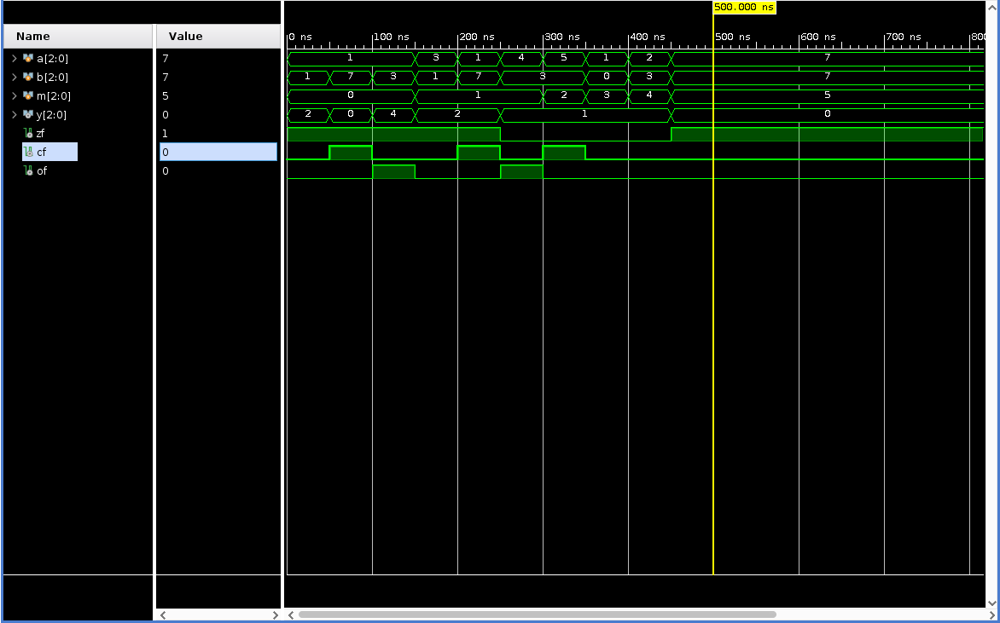
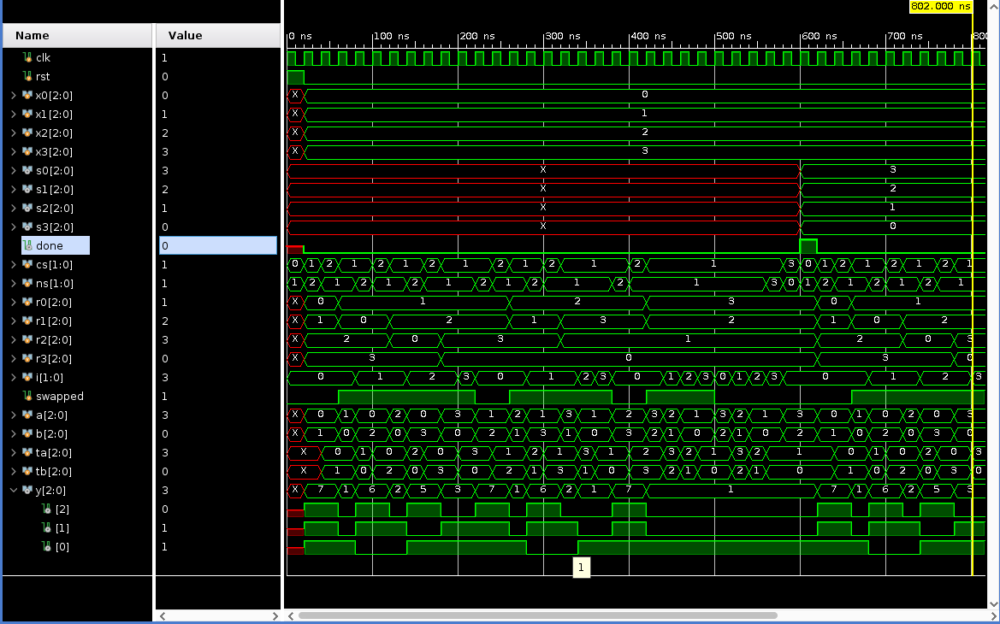

# 实验一 运算器与排序 报告

明宇龙 PB18111710

## 实验目标

1. 实现 ALU
2. 实现硬件排序器

## 实验内容

### ALU

按照功能表，使用 `case` 划分情况进行处理即可。需要明确 cf、of、zf 三个标记的生成过程。

仿真结果如下所示：

### 排序器

实现思路采用冒泡排序，读入后两两对比交换顺序，直到一轮对比后没有交换发生，即可通知排序完成。

比较的部分由于使用了 ALU，直接将两数相减即可。若结果为正数且未溢出或负数且溢出，则前者大于后者，反之亦然。

仿真结果如下所示：

## 思考题

1. 只需在比较大小处将结果取反即可。
2. 可以每次对比两个数，并增大步进，原先思路不变。