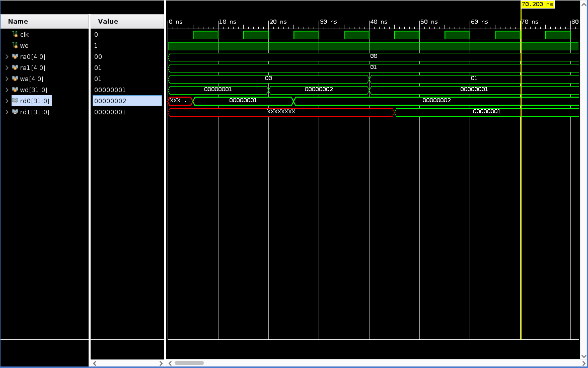
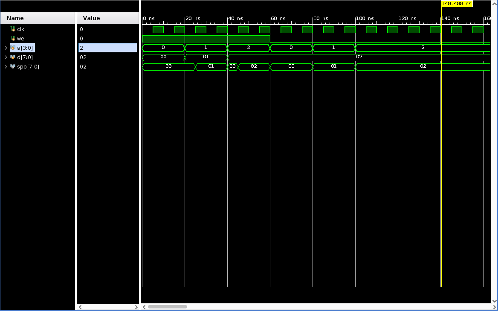
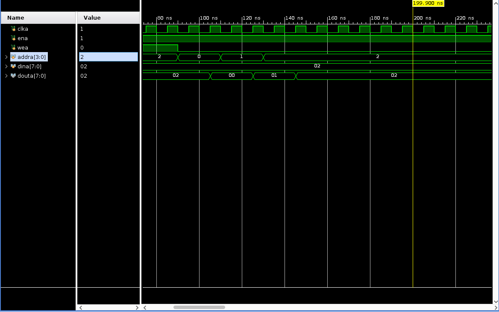
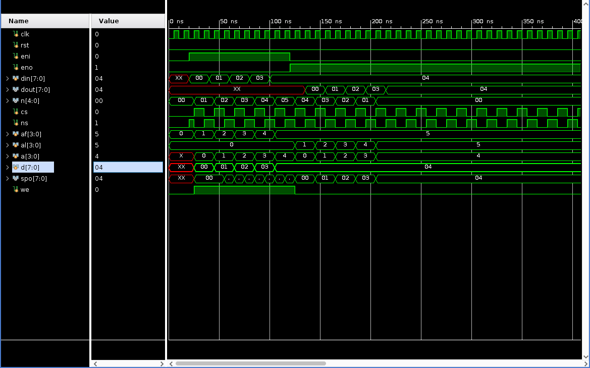

# 实验二 寄存器堆与队列

明宇龙 PB18111710

## 实验目标

1. 实现寄存器堆
2. 熟悉分布式内存和块内存 IP 核的使用
3. 实现 FIFO

## 实验内容

### 寄存器堆

注意到 Verilog 允许端口作数组索引，在 `always` 块中用一数组存储即可。

仿真如下：

## 内存 IP 核

使用 Vivado 内置的内存 IP 核，例化进行读写操作。

分布式内存仿真如下：

可知此内存为异步读，当写使能有效时在上升沿写入。

块内存仿真如下：

可知此内存为当写使能有效时在上升沿写入，读则会在第二次遇到上升沿时完成。

## FIFO

此实现采用了循环队列的方案，出入队列时无需移动内部数据，速度较快。每次出队或入队操作耗费两个时钟周期。

仿真如下：

## 思考题

1. 可以考虑归并排序的方案，对各寄存器堆中的数据排序后两两归并，从而实现所有数据的排序。由于寄存器堆的数量可变，总数据个数自然也是可变的。