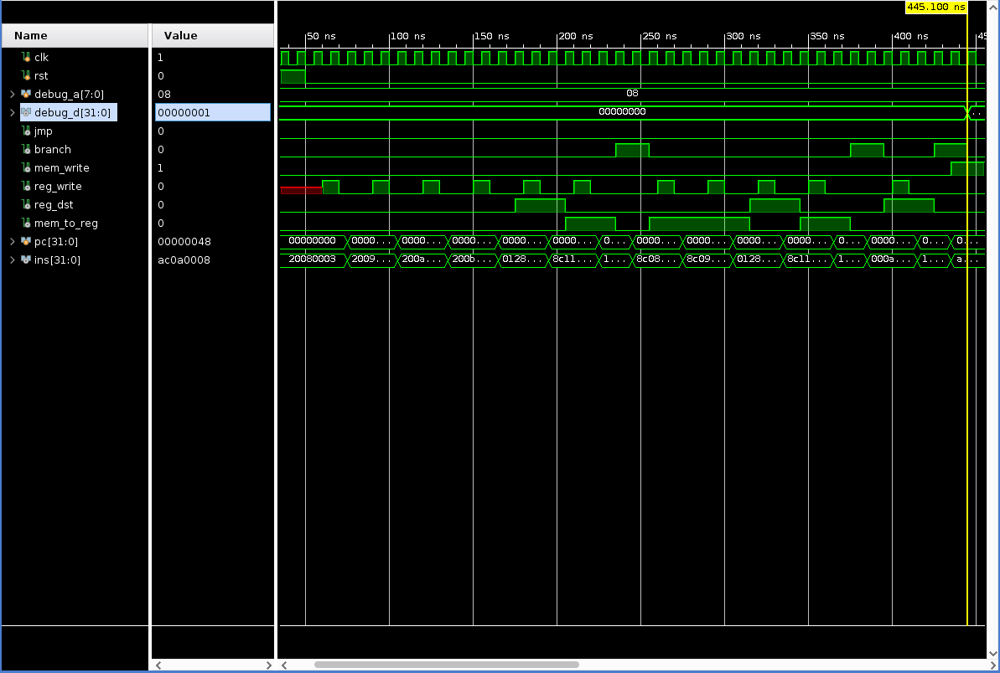
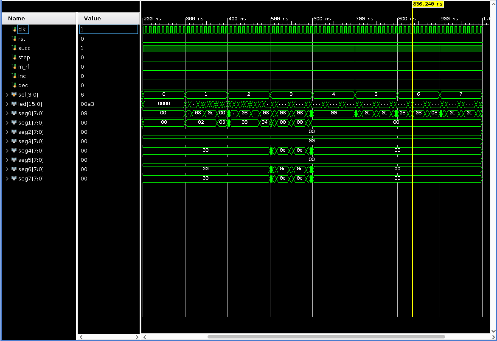

# 实验三 单周期 CPU

明宇龙 PB18111710

## 实验目标

1. 实现单周期 CPU
2. 实现 DBU

## 实验内容

### 单周期 CPU

根据所给逻辑框图完成 CPU 内部的连线后，再实现一个控制单元完成信号控制即可。

这里 CPU 工作状态被分为 IF-ID、EX-MEM、WB 三个状态，在相应状态开始的上升沿完成工作。

仿真如下：

可以看到在指示处 `debug_d` 变为 1，符合助教所给代码的测试标准。

### DBU

增加 CPU 的引出端口，从而满足对寄存器堆和内存的 Debug 访问。

特别地，针对 CPU 的 `clk` 信号，使用了一个 Mux 来选择携带的时钟信号或是一个只翻转的按键控制信号，从而保证时钟信号的时序敏感。

仿真如下：

## 思考题

1. `accm` 指令需要在运算前进行内存访问，因此增加一个 MEM 段的读取置于 ID 段之后 EX 段之前，即可完成这条指令的工作。

