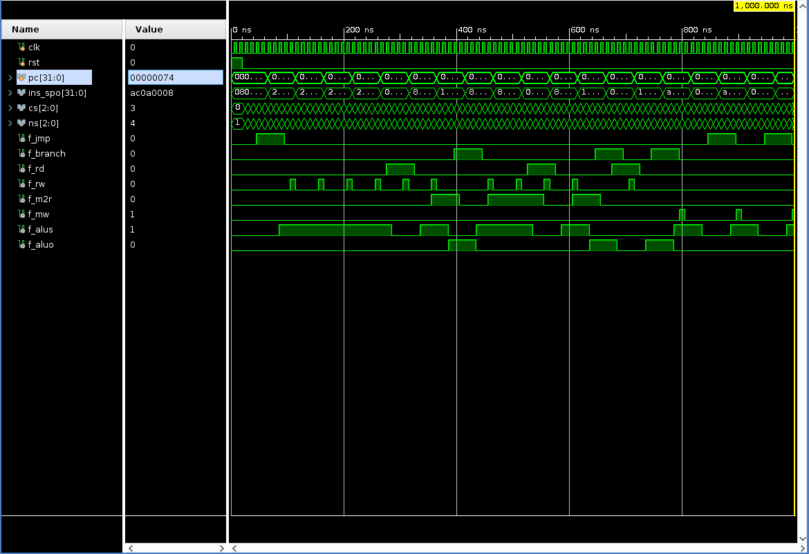

 

# 实验四 多周期 CPU

明宇龙 PB18111710

## 实验目标

1. 实现多周期 CPU

## 实验内容

### 多周期 CPU

与单周期 CPU 类似，根据所给逻辑框图完成 CPU 内部的连线后，再实现一个控制单元完成信号控制即可。实际上具体连线和信号处理可以完全参考单周期 CPU 的设计。

这里额外地将控制单元的 CPU 工作状态导出，并增加阶段间寄存器。

仿真如下：

## 思考题

1. 简单的扩展例如各种 ALU 指令，可以通过增加控制模块对指令中 `funct` 部分的解码结果实现，在实验检查时已呈现过。